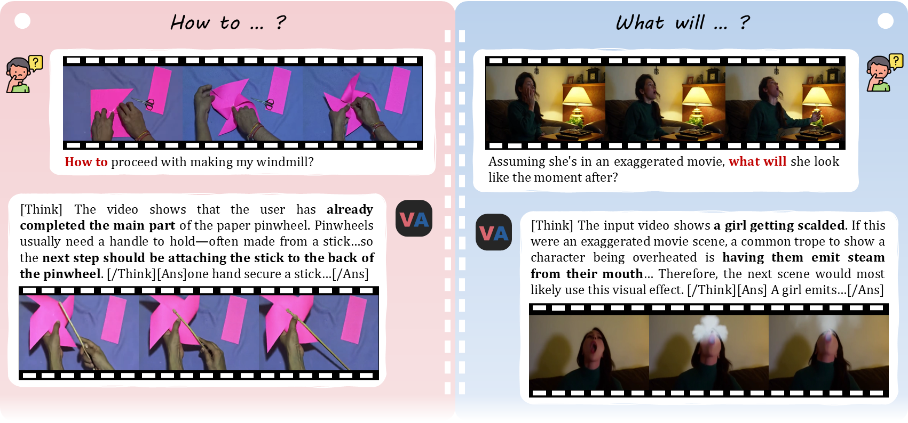
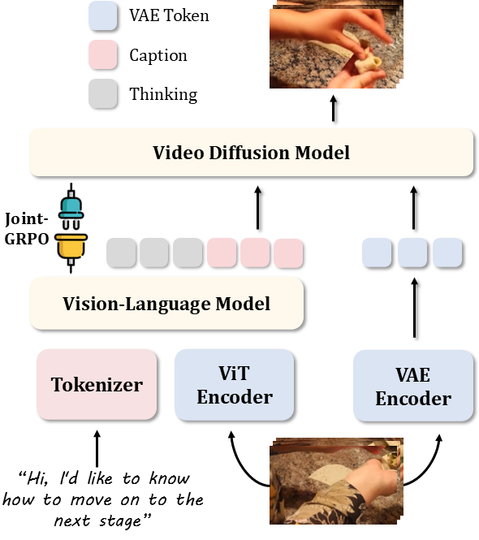
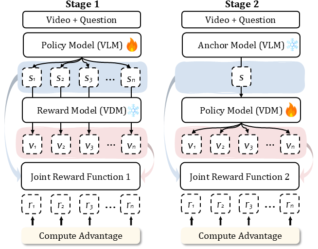

<h1 align="center">Video-as-Answer: Predict and Generate Next Video Event with Joint-GRPO</h1>

<div align='center'>

[Junhao Cheng<sup>1†</sup>](https://donahowe.github.io/),
[Liang Hou<sup>2</sup>](https://liang-hou.github.io/),
[Xin Tao<sup>2</sup>](https://www.xtao.website/),
[Jing Liao<sup>1</sup>](https://scholar.google.com/citations?user=3s9f9VIAAAAJ&hl=en)  
<sup>1</sup>City University of Hong Kong  <sup>2</sup>Kling Team, Kuaishou Technology  
<sup>†</sup> This work was conducted during the author's internship at Kling Team, Kuaishou Technology

<a href="https://video-as-answer.github.io/" target="_blank">
    
</a>
<a href="http://arxiv.org/" target="_blank">
    
</a>
<a href="https://huggingface.co/" target="_blank">
    
</a>

</div>

## 🔎 Introduction



We pioneer **Video-Next-Event Prediction (VNEP)**, extending text-based next-event prediction to dynamic video responses. This shift from *telling* to *showing* enables more intuitive answers for procedural learning and creative exploration.

To tackle VNEP, we propose **VANS**, a model that aligns a Vision-Language Model (VLM) with a Video Diffusion Model (VDM) through our **Joint-GRPO** post-training approach. Our method bridges the semantic-to-visual gap of VLM and VDM, enabling high-quality video event prediction and generation.

## 🏗️ Method

<div align="center">
  <table>
    <tr>
      <td align="center" width="35%">
        
        <br>
        <em>VANS Architecture: Dual-path processing with VLM for reasoning and VDM for generation</em>
      </td>
      <td align="center" width="45%">
        
        <br>
        <em>Joint-GRPO: Two-stage co-steering optimization</em>
      </td>
    </tr>
  </table>
</div>

### Key Components

**VANS Architecture**: Processes input videos and questions through dual pathways:
- **VLM Path**: Performs instruction-grounded reasoning to generate textual captions
- **VDM Path**: Synthesizes videos conditioned on semantic captions and visual context

**Joint-GRPO**: Our two-stage reinforcement learning approach:
- **Stage 1**: Visualization-friendly VLM tuning - optimizes captions for visual plausibility
- **Stage 2**: Context-faithful VDM adaptation - ensures semantic alignment and visual coherence


## 🚀 Quick Start

### 🔮 Environment Setup


To set up the environment for inference, you can run the following command:
```shell
git clone https://github.com/KlingTeam/VANS.git
cd VANS
pip install requirements.txt
```

### 🌎 Download Models

To get started, download the VANS base models:
- **[Qwen2.5-VL-3B](https://huggingface.co/Qwen/Qwen2.5-VL-3B-Instruct)** - The Vision-Language Model
- **[Wan2.1-T2V-1.3B](https://huggingface.co/Wan-AI/Wan2.1-T2V-1.3B)** - The Video Diffusion Model

Then download the complete VANS model:  
**[VANS Model Download](https://huggingface.co/)** *(Coming Soon)*

### 🧸 Demo
To run local gradio demo:
```shell
python app.py
```

## 🚩 Plan
- [ ] Release Training Codes
- [ ] Release VANS-Data-100K dataset
- [ ] Release Inference Codes
- [ ] Release VANS model


## 📜 Citation

If you find our work helpful, please consider giving a star ⭐ and citation 📝

```BibTeXw

```
